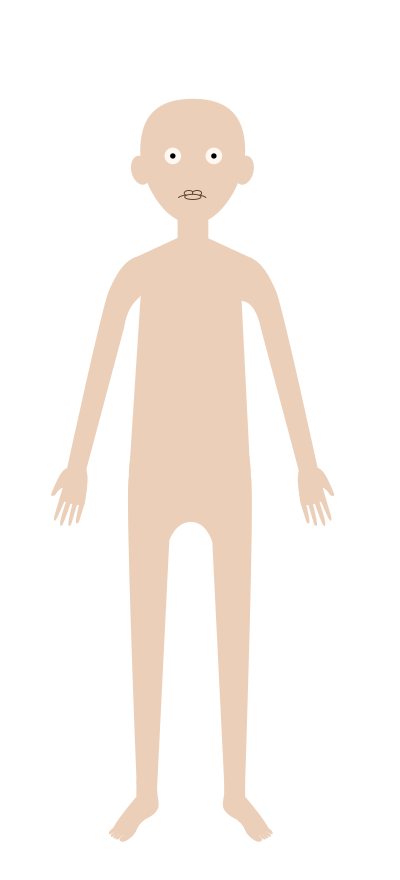

# 개발자 옷 입히기 게임 (Dress-Up Game)

JavaScript로 만드는 인터랙티브 웹 게임 프로젝트

## 📚 강의 개요

### 강의 정보
- **강의 제목**: JavaScript로 만드는 개발자 출근룩 게임
- **강의 대상**: 처음 JavaScript를 배우는 사람이나, 간단한 게임을 만들어 보고 싶은 사람
- **선수 지식**: HTML, CSS, JavaScript의 기초 문법
- **강의 목표**: 드래그 앤 드롭 게임을 만들어 보면서 JavaScript의 DOM 조작, 이벤트 처리, 상태 관리를 실전에서 익힌다
- **예상 소요 시간**: 약 4-5시간
- **플랫폼**: 유튜브 (한글)
- **준비물**:
  - 코드 편집기 (VSCode 권장)
  - 웹 브라우저 (Chrome 권장)
  - macOS 또는 Windows 컴퓨터

### 학습 성과
이 강의를 마치면 다음을 할 수 있게 됩니다:
- ✅ HTML5 Drag and Drop API 활용
- ✅ JavaScript 클래스와 객체 지향 프로그래밍 기초
- ✅ DOM 조작과 이벤트 리스너 활용
- ✅ 동적 요소 생성 및 스타일 제어
- ✅ Promise와 비동기 처리 이해
- ✅ 상태 관리 패턴 구현

---

## 📋 강의 계획표

전체 강의는 **18개의 짧은 강의**로 구성되며, 총 소요 시간은 약 **80-100분**입니다.

| # | 강의 제목 | 주요 내용 | 시간 | 핵심 개념 |
|---|----------|----------|------|----------|
| **Part 1: 시작하기** |
| 01 | 🎮 프로젝트 소개 및 완성본 데모 | - 완성된 게임 시연<br>- 프로젝트 구조 소개<br>- 필요한 에셋 확인 | 5분 | 프로젝트 개요 파악 |
| 02 | 📝 HTML 구조 만들기 | - 캐릭터 영역 작성<br>- 아이템 보드 구조<br>- `data-category` 속성 활용 | 6분 | 시맨틱 HTML, data 속성 |
| 03 | 🎨 CSS 레이아웃 기본 | - Flexbox/Grid 레이아웃<br>- `position: absolute` 활용<br>- 기본 스타일링 | 7분 | CSS 레이아웃, 요소 겹치기 |
| **Part 2: 드래그 앤 드롭 구현** |
| 04 | 🏗️ JavaScript 클래스 구조 설계 | - ES6 클래스 문법<br>- constructor 작성<br>- 상태 객체 설계 (`wornItems`, `zIndexMap`) | 6분 | 클래스, 상태 관리 |
| 05 | 🖱️ 드래그 이벤트 기초 | - `dragstart` 이벤트 처리<br>- `draggedElement` 추적<br>- `effectAllowed` 이해 | 5분 | HTML5 Drag API |
| 06 | 📦 드롭 영역 설정 | - `dragover` 이벤트와 `preventDefault()`<br>- `drop` 이벤트 처리<br>- 드롭 효과 설정 | 5분 | 이벤트 기본 동작 방지 |
| 07 | ✨ 아이템 생성 및 배치 | - 동적으로 DOM 요소 생성<br>- on-body SVG 파일 사용<br>- 캐릭터에 아이템 추가 | 7분 | DOM 조작, createElement |
| **Part 3: 게임 로직** |
| 08 | 🔄 아이템 중복 방지 | - 카테고리별 착용 제한<br>- 기존 아이템 제거 및 교체<br>- 원본 아이템 복원 | 6분 | 조건문, 상태 업데이트 |
| 09 | 📚 z-index로 레이어 관리 | - `zIndexMap` 활용<br>- 카테고리별 쌓임 순서<br>- 스타일 동적 적용 | 5분 | z-index, 레이어 제어 |
| 10 | 🎒 특수 케이스: 백팩 구현 | - div로 이미지 그룹화<br>- 앞/뒤 두 이미지 처리<br>- `pointer-events` 활용 | 6분 | 그룹 요소, 예외 처리 |
| 11 | 👔 특수 케이스: 긴 머리와 예외 처리 | - 파일명으로 특수 케이스 판단<br>- z-index 예외 처리<br>- 조건부 로직 | 4분 | 조건문 분기, 예외 처리 |
| 12 | 🩳 디폴트 의상 (파자마) 처리 | - 상태에 따른 표시/숨김<br>- `updatePajamaVisibility()`<br>- 논리 연산자 활용 | 5분 | 조건부 렌더링, OR 연산 |
| **Part 4: 사용자 인터랙션** |
| 13 | 🖐️ 마우스로 아이템 위치 조정 | - 마우스 이벤트 (`mousedown`, `mousemove`, `mouseup`)<br>- 상대 좌표 계산<br>- 드래그 플래그 패턴 | 7분 | 마우스 이벤트, 좌표 계산 |
| 14 | 🗑️ 영역 밖 드래그로 아이템 삭제 | - `getBoundingClientRect()` 활용<br>- 좌표로 영역 판단<br>- `dragend` 이벤트에서 삭제 처리 | 6분 | 위치 정보, 조건 판단 |
| **Part 5: UX 개선** |
| 15 | ⏳ 로딩 화면 만들기 (기본) | - CSS 애니메이션 (`@keyframes`)<br>- 회전 스피너 구현<br>- `setTimeout` 활용 | 5분 | CSS 애니메이션, 타이머 |
| 16 | 🖼️ 이미지 로드 완료 감지 (심화) | - Promise 패턴<br>- 이미지 `load` 이벤트<br>- `Promise.all()` 활용 | 7분 | Promise, 비동기 처리 |
| 17 | 🎯 시각적 피드백 추가 | - 드래그 시 시각 효과<br>- 호버 효과 및 커서<br>- 클래스 토글 | 4분 | CSS 클래스 조작, 사용자 피드백 |
| **마무리** |
| 18 | 🎉 마무리 및 추가 아이디어 | - 프로젝트 요약<br>- 개선 아이디어 소개<br>- 다음 학습 방향 | 4분 | 프로젝트 회고, 확장 가능성 |

**총 예상 시간: 약 90분**

### 강의 진행 방식
- 각 강의는 **독립적으로 시청 가능**하도록 구성
- 이전 강의 내용을 간단히 복습하고 시작
- 코드는 **따라하기 방식**으로 진행
- 각 강의 마지막에 **핵심 요약** 제공

### 권장 시청 순서
1. **처음 배우는 경우**: 01번부터 순서대로 시청
2. **특정 기능만 필요한 경우**: 해당 Part만 선택 시청
3. **복습하는 경우**: 핵심 강의(04, 05, 07, 08, 13, 16)만 선택 시청

---

## 🎯 강의 구성 (상세)

### Part 1: 프로젝트 준비 (30분)

#### 1-1. 프로젝트 소개 및 데모
- 완성된 게임 시연
- 프로젝트 구조 설명
- 필요한 에셋(SVG 파일) 소개

#### 1-2. HTML 기본 구조 작성
**학습 내용**:
- 시맨틱 HTML 구조 설계
- SVG 이미지 다루기
- `data-*` 속성 활용법

**핵심 코드**:
```html
<div class="character-area">
  
  <div id="character-items"></div>
</div>
<div class="item-board">
  
</div>
```

**중요 포인트**:
- `data-category` 속성으로 아이템 분류
- 적절한 `alt` 텍스트 작성 (접근성)
- 캐릭터 영역과 아이템 보드 분리

#### 1-3. CSS 레이아웃 및 스타일링
**학습 내용**:
- Flexbox/Grid를 활용한 레이아웃
- `position: absolute`로 요소 겹치기
- `z-index` 개념과 레이어 관리

**핵심 CSS**:
```css
#character-items {
  position: absolute;
  top: 0;
  left: 0;
}
.item {
  cursor: grab;
  transition: transform 0.2s;
}
```

---

### Part 2: 드래그 앤 드롭 기본 구현 (60분)

#### 2-1. JavaScript 클래스 구조 설계
**학습 내용**:
- ES6 클래스 문법
- constructor와 메서드
- 상태 관리를 위한 객체 설계

**핵심 코드**:
```javascript
class DressUpGame {
  constructor() {
    this.characterArea = document.querySelector('.character-area');
    this.wornItems = {
      top: null,
      pants: null,
      // ...
    };
    this.zIndexMap = { /* ... */ };
  }
}
```

**중요 포인트**:
- `wornItems` 객체로 현재 착용 상태 추적
- `zIndexMap`으로 레이어 순서 관리
- DOM 요소 참조를 인스턴스 변수로 저장

#### 2-2. 드래그 이벤트 기본
**학습 내용**:
- HTML5 Drag and Drop API
- `dragstart`, `dragover`, `drop`, `dragend` 이벤트
- `effectAllowed`와 `dropEffect` 이해

**핵심 코드**:
```javascript
handleDragStart(e, fromBoard) {
  this.draggedElement = e.currentTarget;
  this.isDraggingFromBoard = fromBoard;
  e.dataTransfer.effectAllowed = 'move';
}

handleDragOver(e) {
  e.preventDefault();
  e.dataTransfer.dropEffect = 'move';
}
```

**중요 포인트**:
- `e.preventDefault()` 필수!
- 드래그 소스 추적 (`draggedElement`)
- 보드에서 드래그 vs 착용한 아이템 드래그 구분

#### 2-3. 드롭 처리 및 아이템 생성
**학습 내용**:
- 동적으로 DOM 요소 생성
- 파일 경로 조작 (on-body SVG 사용)
- 요소 스타일 동적 적용

**핵심 코드**:
```javascript
createItemOnCharacter(sourceItem) {
  const category = sourceItem.dataset.category;
  const onBodyPath = this.getOnBodyPath(sourceItem.src);

  const newItem = this.createNewImgElement(onBodyPath, sourceItem.alt);
  newItem.dataset.category = category;
  newItem.style.zIndex = this.zIndexMap[category];

  this.characterItems.appendChild(newItem);
  this.wornItems[category] = newItem;
}
```

**중요 포인트**:
- `createElement`로 동적 요소 생성
- `appendChild`로 DOM에 추가
- 원본 아이템 참조 저장 (`sourceItem`)

---

### Part 3: 게임 로직 구현 (60분)

#### 3-1. 카테고리별 아이템 중복 방지
**학습 내용**:
- 조건문으로 상태 확인
- 기존 요소 제거 및 교체
- DOM 조작 메서드 활용

**핵심 코드**:
```javascript
if (this.wornItems[category]) {
  const oldItem = this.wornItems[category];
  if (oldItem.sourceItem) {
    oldItem.sourceItem.style.display = '';
  }
  oldItem.remove();
}
```

**중요 포인트**:
- 같은 카테고리는 하나만 착용 가능
- 이전 아이템은 보드로 복귀
- `display: none` ↔ `display: ''` 토글

#### 3-2. z-index 관리 및 예외 처리
**학습 내용**:
- z-index로 레이어 순서 제어
- 특수 케이스 처리 (긴 머리, 가방)
- 조건문과 분기 처리

**핵심 코드**:
```javascript
this.zIndexMap = {
  body: 0,
  socks: 1,
  shoes: 2,
  pants: 3,
  top: 4,
  outer: 5,
  bag: 6,
  hair: 7,
  headwear: 8
};

// 예외 처리
if (category === 'hair' && filename === 'long-straight') {
  zIndex = this.zIndexMap.body + 1;
}
```

**중요 포인트**:
- 논리적인 레이어 순서 정의
- 예외 케이스 고려 (긴 머리는 몸 뒤로)
- 가방은 앞/뒤 두 이미지로 구성

#### 3-3. 그룹 아이템 구현 (백팩)
**학습 내용**:
- div 컨테이너로 여러 이미지 그룹화
- 각 이미지에 다른 z-index 적용
- `pointer-events` 활용

**핵심 코드**:
```javascript
const newGroup = document.createElement('div');
newGroup.className = 'placed-group';

const backImg = this.createNewImgElement(backPath, alt, '', true);
const frontImg = this.createNewImgElement(frontPath, alt, '', true);

backImg.style.zIndex = (this.zIndexMap.body - 1).toString();
frontImg.style.zIndex = this.zIndexMap.bag.toString();

newGroup.appendChild(backImg);
newGroup.appendChild(frontImg);
```

**중요 포인트**:
- 그룹 내부 이미지는 `pointer-events: none`
- 부모 div만 드래그/클릭 가능
- 앞/뒤 이미지로 입체감 표현

#### 3-4. 디폴트 의상 처리
**학습 내용**:
- 조건부 렌더링
- 상태에 따른 UI 업데이트
- 논리 연산자 활용

**핵심 코드**:
```javascript
updatePajamaVisibility() {
  if (this.wornItems.top || this.wornItems.outer) {
    this.pajamaTop.style.display = 'none';
  } else {
    this.pajamaTop.style.display = 'block';
  }
}
```

**중요 포인트**:
- 상의/아우터 착용 시 파자마 상의 숨김
- 바지 착용 시 파자마 하의 숨김
- 논리적 OR 연산자 활용

---

### Part 4: 사용자 인터랙션 심화 (60분)

#### 4-1. 착용한 아이템 위치 조정 (마우스 드래그)
**학습 내용**:
- 마우스 이벤트 (`mousedown`, `mousemove`, `mouseup`)
- 상대 좌표 계산
- 이벤트 플래그 패턴

**핵심 코드**:
```javascript
const handleMouseDown = (e) => {
  isDragging = true;
  initialX = e.clientX - currentX;
  initialY = e.clientY - currentY;
};

const handleMouseMove = (e) => {
  if (!isDragging) return;
  currentX = e.clientX - initialX;
  currentY = e.clientY - initialY;
  item.style.left = `${currentX}px`;
  item.style.top = `${currentY}px`;
};
```

**중요 포인트**:
- 드래그 플래그로 상태 관리
- 초기 위치 기준으로 상대 좌표 계산
- `preventDefault()`로 기본 동작 방지

#### 4-2. HTML5 드래그와 마우스 드래그 충돌 해결
**학습 내용**:
- 두 가지 드래그 메커니즘 공존
- 동적으로 `draggable` 속성 변경
- 이벤트 우선순위 제어

**핵심 개념**:
- 클릭만 하면: HTML5 드래그 활성화 (휴지통/영역 밖으로 드래그)
- 5px 이상 움직이면: 마우스 드래그 모드 (위치 조정)
- 상황에 따라 `item.draggable` 토글

#### 4-3. 영역 밖 드래그로 아이템 삭제
**학습 내용**:
- 요소의 위치 정보 가져오기 (`getBoundingClientRect()`)
- 마우스 좌표와 비교
- `dragend` 이벤트 활용

**핵심 코드**:
```javascript
checkAndRemoveIfOutside(e, item, category) {
  const rect = this.characterArea.getBoundingClientRect();
  const x = e.clientX;
  const y = e.clientY;

  const isOutside = x < rect.left || x > rect.right ||
                    y < rect.top || y > rect.bottom;

  if (isOutside) {
    // 아이템 삭제 및 원본 복원
    item.remove();
    if (item.sourceItem) {
      item.sourceItem.style.display = '';
    }
  }
}
```

**중요 포인트**:
- `getBoundingClientRect()`로 요소 위치/크기 정보
- 좌표 비교로 영역 내/외 판단
- 삭제 시 원본 아이템 복원 필수

---

### Part 5: 로딩 및 사용자 경험 개선 (45분)

#### 5-1. 로딩 화면 기본 구현
**학습 내용**:
- CSS 애니메이션 (`@keyframes`)
- `setTimeout` 활용
- 조건부 표시/숨김

**핵심 코드**:
```css
@keyframes spin {
  0% { transform: rotate(0deg); }
  100% { transform: rotate(360deg); }
}

.loading-spinner {
  animation: spin 1s linear infinite;
}
```

```javascript
setTimeout(() => {
  loadingScreen.style.display = 'none';
  itemBoardContent.style.display = 'block';
}, 2000);
```

#### 5-2. 이미지 로드 완료 감지 (심화)
**학습 내용**:
- Promise와 비동기 처리
- 이미지 로드 이벤트
- `Promise.all()` 패턴

**핵심 코드**:
```javascript
function waitForImagesToLoad() {
  const images = itemBoardContent.querySelectorAll('img.item');

  const imagePromises = Array.from(images).map(img => {
    return new Promise((resolve) => {
      if (img.complete) {
        resolve();
      } else {
        img.addEventListener('load', resolve);
        img.addEventListener('error', resolve);
      }
    });
  });

  return Promise.all(imagePromises);
}

waitForImagesToLoad().then(() => {
  // 로딩 화면 숨기기
});
```

**중요 포인트**:
- `img.complete`로 이미 로드된 이미지 확인
- 각 이미지에 대해 Promise 생성
- `Promise.all()`로 모든 이미지 대기
- 에러 발생 시에도 계속 진행

#### 5-3. 사용자 경험 개선
**추가 고려사항**:
- 드래그 시 시각적 피드백 (`drag-over` 클래스)
- 호버 효과와 커서 변경
- 반응형 디자인 고려 (선택적)

---

## 🎨 심화 기능 (선택 사항)

### 추가 구현 아이디어

#### 1. 이미지 캡처 및 다운로드
**학습 내용**:
- `html2canvas` 라이브러리 활용
- Blob과 파일 다운로드
- Canvas API 기초

**구현 목표**:
```javascript
// 캐릭터 영역을 이미지로 캡처
html2canvas(characterArea).then(canvas => {
  const link = document.createElement('a');
  link.download = 'my-outfit.png';
  link.href = canvas.toDataURL();
  link.click();
});
```

#### 2. 점수 시스템
**학습 내용**:
- 아이템별 속성 데이터 관리
- 점수 계산 로직
- UI 업데이트

**예시 데이터 구조**:
```javascript
const itemScores = {
  'three-color-knit': { style: 5, comfort: 3, professionalism: 4 },
  'hoodie': { style: 3, comfort: 5, professionalism: 2 }
};
```

#### 3. 로컬 스토리지 저장
**학습 내용**:
- `localStorage` API
- JSON 직렬화/역직렬화
- 게임 상태 저장/불러오기

**핵심 코드**:
```javascript
// 저장
saveGame() {
  const state = {
    wornItems: this.wornItems,
    positions: { /* ... */ }
  };
  localStorage.setItem('dressUpGame', JSON.stringify(state));
}

// 불러오기
loadGame() {
  const saved = localStorage.getItem('dressUpGame');
  if (saved) {
    const state = JSON.parse(saved);
    // 상태 복원
  }
}
```

#### 4. 안내 튜토리얼
**학습 내용**:
- 모달/오버레이 구현
- 단계별 가이드 시스템
- 타이머와 이벤트 조합

**구현 아이디어**:
- 첫 방문 시 자동으로 튜토리얼 표시
- 다음 버튼 클릭 또는 2초 후 자동 진행
- 스킵 버튼으로 건너뛰기

#### 5. 반응형 디자인 및 모바일 제한
**학습 내용**:
- 미디어 쿼리
- 터치 이벤트 처리
- 디바이스 감지

**핵심 코드**:
```javascript
if (window.innerWidth < 768) {
  showMessage('이 게임은 데스크톱에서만 플레이 가능합니다.');
}
```

---

## 🐛 트러블슈팅 가이드

### 자주 발생하는 문제

#### 1. 드래그가 작동하지 않음
**원인**:
- `e.preventDefault()` 누락
- `draggable="true"` 속성 누락
- 이벤트 리스너 등록 순서 문제

**해결**:
```javascript
// dragover 이벤트에 반드시 preventDefault 필요
handleDragOver(e) {
  e.preventDefault(); // 필수!
}
```

#### 2. 이미지가 겹치는 순서가 이상함
**원인**:
- z-index 값 누락 또는 문자열로 지정
- position 속성 누락

**해결**:
```javascript
item.style.zIndex = zIndex.toString(); // 숫자를 문자열로
item.style.position = 'absolute'; // position 필수
```

#### 3. 아이템이 삭제되지 않음
**원인**:
- `wornItems` 상태 업데이트 누락
- 원본 아이템 참조 손실

**해결**:
```javascript
// 삭제 시 반드시 상태도 업데이트
this.wornItems[category] = null;
item.sourceItem.style.display = '';
```

#### 4. 마우스 드래그와 HTML5 드래그 충돌
**원인**:
- 두 메커니즘이 동시에 작동
- `preventDefault()` 위치 문제

**해결**:
- 동적으로 `draggable` 속성 변경
- 움직임 감지로 모드 전환

---

## 📝 실습 과제

### 기본 과제
1. **새로운 카테고리 추가**: 안경, 목걸이 등 액세서리 카테고리 추가
2. **색상 변경**: 같은 아이템의 다양한 색상 버전 구현
3. **초기화 버튼**: 모든 아이템을 제거하고 파자마로 돌아가는 버튼 추가

### 심화 과제
1. **랜덤 코디**: 버튼 클릭 시 무작위로 아이템 조합
2. **추천 코디**: 미리 정의된 코디 세트 적용 기능
3. **배경 변경**: 계절/장소에 따른 배경 이미지 전환

---

## 📖 참고 자료

### 공식 문서
- [MDN - Drag and Drop API](https://developer.mozilla.org/en-US/docs/Web/API/HTML_Drag_and_Drop_API)
- [MDN - Promise](https://developer.mozilla.org/ko/docs/Web/JavaScript/Reference/Global_Objects/Promise)
- [MDN - getBoundingClientRect](https://developer.mozilla.org/ko/docs/Web/API/Element/getBoundingClientRect)

### 추천 학습 자료
- JavaScript 클래스와 객체지향 프로그래밍
- DOM 조작 완벽 가이드
- 이벤트 루프와 비동기 처리

---

## 🎬 강의 촬영 팁

### 영상 구성
1. **인트로 (5분)**: 완성본 시연 및 학습 목표 소개
2. **따라하기 (본편)**: 단계별 코딩 실습
3. **트러블슈팅 (10분)**: 자주 발생하는 오류 해결
4. **아웃트로 (5분)**: 요약 및 추가 학습 방향 제시

### 촬영 시 주의사항
- 코드 타이핑 속도 적절히 조절
- 각 코드 블록마다 설명 추가
- 콘솔 출력으로 중간 결과 확인
- 주요 개념은 시각 자료로 보충

### 화면 구성
- 왼쪽: 코드 에디터
- 오른쪽: 브라우저 (실행 결과)
- 하단: 개발자 도구 콘솔 (필요시)

---

## 💡 추가 개선 아이디어

### 게임플레이
- 계절별 테마 (여름/겨울 옷)
- 직업별 코디 (개발자/디자이너)
- 레벨 시스템 (잠금 해제)

### 기술적 개선
- TypeScript로 타입 안정성 추가
- React/Vue로 컴포넌트화
- 웹팩으로 번들링 최적화
- PWA로 오프라인 지원

---

## 🙏 마무리

이 프로젝트를 통해 JavaScript의 핵심 개념을 재미있게 학습할 수 있습니다. 단순히 따라하는 것을 넘어, 자신만의 아이디어를 추가하여 확장해보세요!

**학습 순서 추천**:
1. 기본 기능 완성 (Part 1-3)
2. 심화 인터랙션 구현 (Part 4)
3. UX 개선 (Part 5)
4. 자신만의 기능 추가 (심화 과제)

**질문이나 피드백은 언제든지 환영합니다!** 🎉
